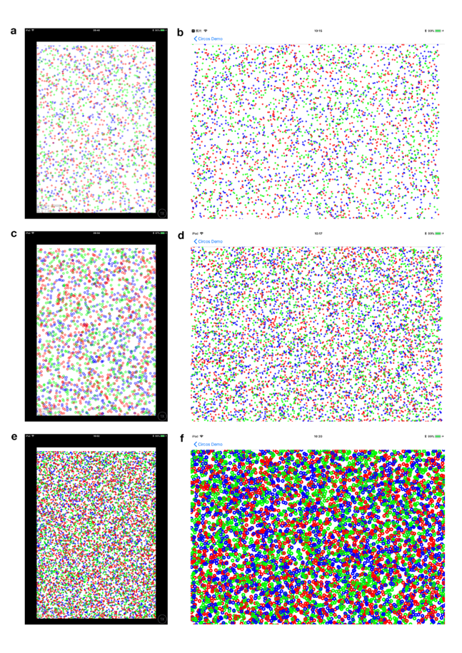
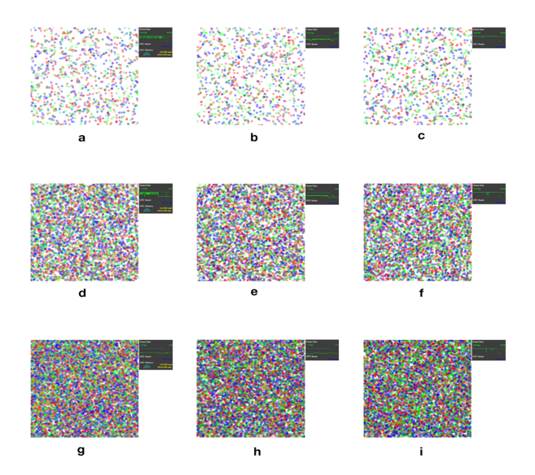
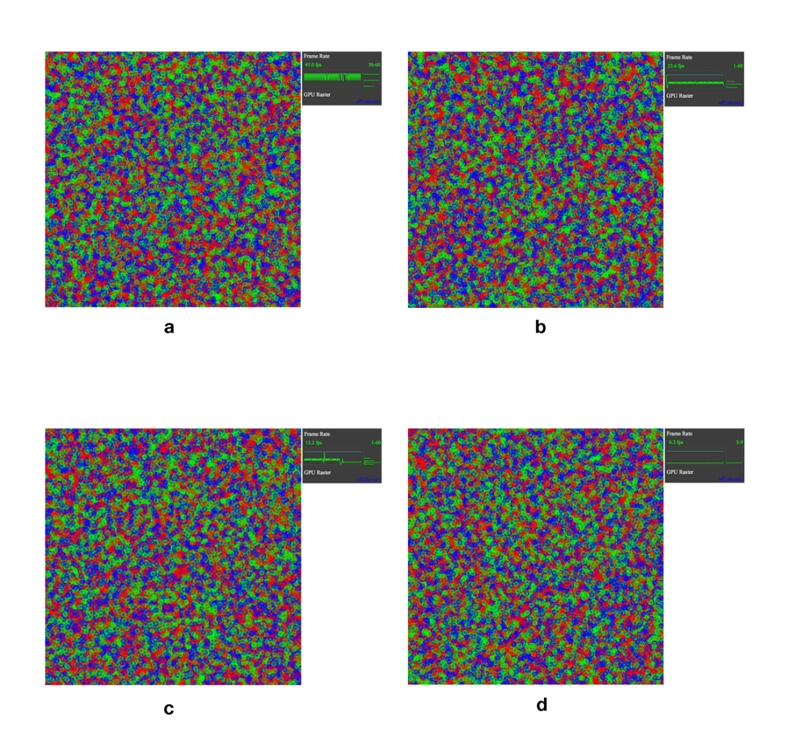

## Performance Comparison

### iOS Side
Comparison between the mobile side and iOS native control 
Experimental environment: ipad mini 2
Model: ME280CH / A
Operating System: iOS 11.0.3 (15A432)
Processor: Apple A7 processor
Capacity: 32GB 

Experimental content: Display the basic graphics through XX and native controls on the same ipad, and view the change of frame rate. In this example, 5000, 10000, 50000 circular basic graphics with the size of 10px * 10px are rendered in a space of 2500px * 2500px using two rendering methods to track the change of the frame rate of the hardware.

(a) and (b) 5000 basic graphics; (c) and (d) 10000 basic graphics: (e) and (f) 50000 basic graphics. (a) Rendering example of XX. (b) Display results using an Apple-native Cocoa control based on an objective-c call. The stable frame rates are 60 fps in the former, and 40 fps in the latter. (c) Rendering example of XX. (d) Display results using an Apple-native Cocoa control based on an objective-c call. The stable frame rates are 60 fps in the former, and 10-20 fps in the latter. (e) Rendering example of XX. (f) Display results using an Apple-native Cocoa control based on an objective-c call. The stable frame rates are 60 fps in the former, and 18 fps in the latter. Still, in the latter case, there are lags for a few seconds in zooming moves with the frame rate dropped to around 1 fps. It indicates that the basic function cannot be used normally, and there will be too much memory occupied by the system to cause the termination of the process.

xx, which uses texture-based batch rendering, has a significant advantage over Cocoa native controls in displaying large amounts of basic elements. This advantage in the mobile terminal ensures a smooth visualization of more data information.

### Web Side
Performance comparison of XX on web side, the Chart.js library using canvas, and d3.js library using svg.
Experimental environment: iMac (Retina 5K, 27-inch, Late 2015) Browser Chrome (version 64)
Experimental Content: Compare the performance of the three types of graphics on chrome. The graphics in the demo will be continuously updated dynamically. Click on the “Add” button to add more graphics to compare the performance differences by measuring the fps.

Svg-based d3.js rendering, canvas-based chart.js, and XX using webGL rendering.
(a), (b), (c) 1000 basic graphics; 50fps, 26fps, 60fps;
(d), (e), (f) 5000 basic graphics; 11.8fps, 2.2fps, 56fps;
(g), (h), (i) 10000 basic graphics; 5.7fps, 1fps, 55fps.

Continue to increase the amount of data, d3.js and chart.js page crashes, but XX rendering can still maintain favorable performance. The following test is on XX performance for huge amount of data.

The stable frame rates are 45fps, 23.6fps, 12.2fps, and 6.3fps for (a) 50000, (b) 100000, (c) 200000, and (d) 400000 basic graphics, respectively.

From the perspective of rendering performance, XX library has obvious advantages than svg-based and canvas-based graphics libraries.