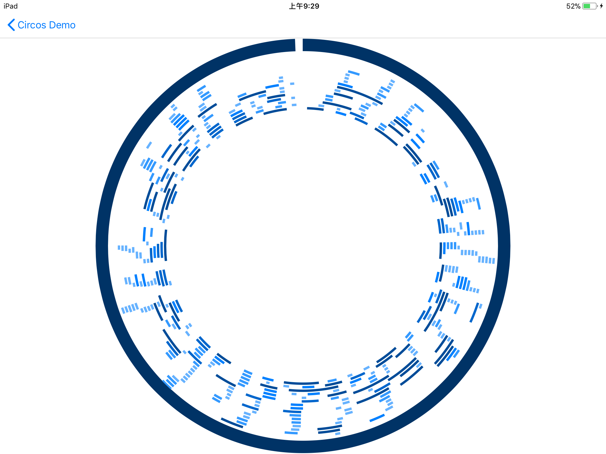

## Documentation

## XXLibrary

XXLibrary is a high-performance cross-platform engine for comparative visualization and interactive exploration of diverse bioinformatics data.

todo add a pic

## Getting Started

- Visit the [Demo website](http://dataviztest.sciencewall.net/) and find out what you can do with XXLibrary.
- First time with XXLibrary? Read the [Overview](#overview) section below and then check out the Usages & Examples. 
- We provide tutorial for both [web developers](#for-web-developers) and [iOS developers](#for-ios-developers).
- Still need some help? Submit an issue on [Github](https://github.com/XiaLab/dataviz/issues) or contact us with email: contact@sciencewall.net

## Overview

XXLibrary is a high-performance cross-platform engine for comparative visualization and interactive exploration of diverse bioinformatics data. Applications integrated with XXLibrary can interactively customize the presentation of user requirements on both web pages and mobile apps. 

Through more in-depth interaction attributes, users are capable of instantly operating on the figures and dynamically organizing the presentation to obtain highlight, comparison and other desired exhibitions. The high-performance visualization engine can be integrated in data analysis tools as a .lib document to facilitate bioinformatics research, and it is also designed to be accessible to a wide range of users, including bench biologists and bioinformaticians.

## For Web Developers

### Requirements

XXLibrary depends on some third-party libraries, including:

1. [d3.js](https://d3js.org/) - we use this lib to fetch files, format data and calculate the coordinates of the graph.
2. [pixi.js](http://www.pixijs.com/) - use to render the canvas
3. [lodash](https://lodash.com/) - convenient for manipulating data

### Installation

you can directly use the script by embed this code to your html file. 

```html
<script src="http://www.sciencewall.net/plot.js"></script>
```

if you use npm, just use the command `npm install Plot.js` to install the library.

### Usage & Example

There are some steps to draw the graph you want.

#### Prepare Bioinformatics Data

Prepare the data that needs to be displayed and decide which graph type the data will eventually be displayed. Our library can accept input files in a variety of formats, JSON, csv, tsv, dsv, and so on.

Here we try to draw the circular heatmap to explain the whole steps.

Firstly, we need to prepare the layout data, which builds the base structure of the graph.

```json
[{
		"id": "chr1",
		"label": "chr1",
		"color": "#996600",
		"len": 307041717
	},
	{
		"id": "chr2",
		"label": "chr2",
		"color": "#666600",
		"len": 244442276
	},
	{
		"id": "chr3",
		"label": "chr3",
		"color": "#99991E",
		"len": 235667834
	}
]
```

The array above record the whole chromosome information, it has three chromosomes and each of them has individual information.

Then, we prepare the heatmap data, which like this: 

```text
chrom	start		end			value
chr1	0			1000000		0.5201
chr1	1000000		2000000		0.5611
chr1	2000000		3000000		0.4287
chr1	3000000		4000000		0.2948
chr1	4000000		5000000		0.3224
chr1	5000000		6000000		0.3174
chr1	6000000		7000000		0.3890
chr1	7000000		8000000		0.3749
chr1	8000000		9000000		0.3697
chr1	9000000		10000000	0.3966
chr1	10000000	11000000	0.4011
chr1	11000000	12000000	0.4692
chr1	12000000	13000000	0.3136
chr1	13000000	14000000	0.4483
chr1	14000000	15000000	0.4235
chr1	15000000	16000000	0.4016
chr1	16000000	17000000	0.4078
chr1	17000000	18000000	0.3969
chr1	18000000	19000000	0.5061
chr1	19000000	20000000	0.3889
chr1	20000000	21000000	0.5129
chr1	21000000	22000000	0.4522
chr1	22000000	23000000	0.4045
chr1	23000000	24000000	0.4243
chr1	24000000	25000000	0.4610
chr1	25000000	26000000	0.3945
chr1	26000000	27000000	0.4484
```

Each row of the file represents a chromosome fragment, and each row records the start and end of the chromosomal fragment. We use this data to draw the circular heatmap.

You can directly download the file [10GRCh37.json](), [CHG.v3.bed]() and [CHH.v3.bed]() to try the process.

#### Call APIs to Read Data and Draw figure

We has already packed up the process of drawing graph and provide the api to simplify the flow.

```javascript
new Plot.circular(elem).chords({
	fileUrl: '/dist/heatmap/10GRCh37.json',
	fileType: 'json',
	configs: {
		innerRadius: 300,
		outerRadius: 320,
		labels: true,
		ticks: true
	}
}, [{
	circularType: 'heatmap',
	name: 'CHG',
	fileUrl: '/dist/heatmap/CHG.v3.bed',
	fileType: 'tsv',
	configs: {
		innerRadius: 0.8,
		outerRadius: 0.95
	}
}, {
	circularType: 'heatmap',
	name: 'CHH',
	fileUrl: '/dist/heatmap/CHH.v3.bed',
	fileType: 'tsv',
	configs: {
		innerRadius: 0.5,
		outerRadius: 0.75
	}
}]);
```

just call the api and pass the data and configurations or you can custom the color, radius and so on to draw what you want.

And we can visit [heatmap]() to check the demo.

### API Document 

[More information](Web/README.md)

## For iOS Developers

### Requirements

XXLibrary requires iOS 9.0 and above.

Several third-party open source libraries are used within XXLibrary, including:

1. [Colours](https://github.com/bennyguitar/Colours) - Color Supporting
2. [Mantle](https://github.com/Mantle/Mantle) - JSON Supporting
3. [React Native](https://github.com/facebook/react-native) - If you wanna use JavaScript in our library

The following Cocoa frameworks must be linked into the application target for proper compilation:

1. GLKit.framework
2. OpenGLES.framework
3. QuartzCore.framework

### Installation

We compiled our library into a .a file and provide it's header files. Create a new project or open an existed project in Xcode, and import out static library with it's header files.

The recommended approach for installing third-party libraries is via the [CocoaPods](https://cocoapods.org/) package manager, as  it provides flexible dependency management and dead simple installation.

Create Podfile and input the follow text:

```shell
target "YOUR PROJECT" do
	platform:ios, '9.0'
	pod 'Mantle'
	pod 'Colours'
	
	pod 'React', :path => '../node_modules/react-native', :subspecs => [
		'Core',
		'CxxBridge', # Include this for RN >= 0.47
		'DevSupport', # Include this to enable In-App Devmenu if RN >= 0.43
		'RCTText',
		'RCTNetwork',
		'RCTWebSocket', # Needed for debugging
		'RCTAnimation', # Needed for FlatList and animations running on native UI thread
		# Add any other subspecs you want to use in your project
	]
	pod 'yoga', :path => '../node_modules/react-native/ReactCommon/yoga'
	pod 'DoubleConversion', :podspec => '../node_modules/react-native/third-party-podspecs/DoubleConversion.podspec'
	pod 'glog', :podspec => '../node_modules/react-native/third-party-podspecs/glog.podspec'
	pod 'Folly', :podspec => '../node_modules/react-native/third-party-podspecs/Folly.podspec'
end
```

Install third-party libraries into your project:

```shell
$ pod install
```

ReOpen your project in Xcode from the .xcworkspace file.

Now add Cocoa framework to your project. Open your project and navigate to `Build Phases` page,and at the `Link Binary With Libraries` , add the following frameworks:

```
1. GLKit.framework
2. OpenGLES.framework
3. QuartzCore.framework
```

### Usage & Example

XXLibrary is easy to use for iOS developers. There are 4 major steps.

#### Prepare Bioinformatics Data

Prepare the data that needs to be displayed and decide which graph type the data will eventually be displayed. Our library can accept input files in a variety of formats, JSON, csv, tsv, dsv, and so on.

Take the following [segdup.csv](images/segdup.csv) file as an example.

````
chr,start,end
chr1,465,30596
chr1,486,76975
chr1,486,30596
chr1,486,9707
chr1,486,9707
chr1,486,9707
chr1,8256,76975
chr1,23908,30596
chr1,59871,76975
chr1,71096,76975
chr1,71096,76975
chr1,71096,76975
...
````

Each row of the file represents a chromosome fragment, and each row records the start and end of the chromosomal fragment. We hope that all the chromosome fragments are eventually displayed in the form of a band. So we decide to use a stack figure to draw the data.

#### Write Configuration Code

The differences between each chromosome fragment represented in the segdup.csv file are (i) start site and end site (ii) thelength of the fragment. 

In order to display each chromosome fragment in the correct position, we use the form of a stack figure. To quickly distinguish the chromosomal fragments, we use different colors to represent their different lengths.

The configuration file can be stored as a JSON file, or it can be written directly in the form of a Key-Value.

The following is the configuration code.

````objective-c
NSDictionary *configuration = @{
            @"innerRadius": @(0.7f),  // The starting position of the inner radius of Stack
            @"outerRadius": @(1.0f),  // The end of the outer radius of Stack
            @"color": ^NSString *(NSMutableDictionary *d) {
                CGFloat astart = [d[@"start"] floatValue]; // astart: start position
                CGFloat aend = [d[@"end"] floatValue]; // aend: end position
                if (aend - astart > 150000) {
                    return @"#004c99";  // When the clip length is larger than 150000, the clip is displayed in #004c99
                } else if (aend - astart > 120000) {
                    return @"#0066cc"; // larger than 120000, in #0066cc
                } else if (aend - astart > 90000) {
                    return @"#0080ff"; // larger than 90000, in #0080ff
                } else if (aend - astart > 60000) {
                    return @"#3399ff"; // larger than 60000, in #3399ff
                } else if (aend - astart > 30000) {
                    return @"#66b2ff"; // larger than 30000, in #66b2ff
                } else {
                    return nil;
                }
            },
            @"thickness": @(4.0f), // the width on the screen
};
````

#### Call APIs to Read Data and Draw figure

At [API Document](#api-document-1) section, we provide a lot of APIs, including: Reading data and Drawing figures.

- Call API to read segdup.csv data

  ````objective-c
  DFIDSV *parseCSV = [[DFIDSV alloc] initWithDelimiter:@","];
  [parseCSV parseWithTextFileName:@"segdup" andFileSuffix:@"csv"];
  DFIDSVParseResult *parseResult = parseCSV.result;
  ````

- Call API to draw stack figure

  ````objective-c
  DFICircosStack *stack = [[DFICircosStack alloc] initWithCircos:circos conf:conf data:preSegdup2];
  [stack renderToView:self.testView];
  ````

#### Run Xcode and check the result



Each chromosome fragment in the correct position and different colors.

### API Document

#### Base Shape

[Base Shape](iOS/README.md#base-shape) provide APIs to draw base shapes. 

#### Circular Shape

[Circular Shape](iOS/README.md#circular-shape) provide APIs to draw circular shapes and the circular shape's layout.

[More information](iOS/README.md)

## Performance Comparison

Please check out this page for [Performance Comparison](Performance.md).

## Credits

XXLibrary is brought to you by XiaLab.

If you have any questions, please contact contact@sciencewall.net
